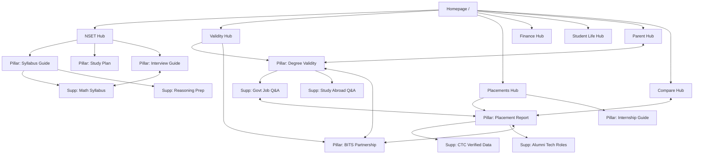

# Scaler School of Technology (SST) Community Platform: Information Architecture & SEO Strategy

This document outlines the complete Information Architecture (IA), URL structure, navigation, internal linking strategy, and pre-launch content plan for the community-driven Q&A, Guides, and Experiences platform focused on SST, NSET, and related student/parent concerns.

---

# 1. Category: NSET & Admission Process

## Subcategory: NSET Exam Structure & Syllabus

### Pillar Pages
* [The Ultimate Guide to NSET: Syllabus, Exam Pattern & Eligibility](https://sst-community.in/nset/syllabus-pattern-guide) `[Audience: Students]` `[Type: Informational]`
* [NSET Sample Question Papers & Official Mock Tests Directory](https://sst-community.in/nset/sample-papers-mock-tests) `[Audience: Students]` `[Type: Informational]`

### Supporting Pages
* [NSET Mathematics Syllabus: Weightage & Important Topics](https://sst-community.in/nset/math-syllabus-weightage) `[Audience: Students]` `[Type: Informational]`
* [NSET Algorithmic Thinking & Logical Reasoning Prep Guide](https://sst-community.in/nset/logical-reasoning-prep) `[Audience: Students]` `[Type: Informational]`
* [NSET Marking Scheme, Cut-offs & Passing Marks Analysis](https://sst-community.in/nset/marking-scheme-cutoffs) `[Audience: Students]` `[Type: Informational]`
* [Q&A: What is the difficulty level of NSET compared to JEE Mains?](https://sst-community.in/nset/qa-difficulty-vs-jee) `[Audience: Both]` `[Type: Experiential]`

### Related Categories
* NSET Preparation & Resources
* Scholarships & Fees

### User Intent
Students search for details about what NSET actually tests, its eligibility requirements, and the basic test mechanics to evaluate if they can qualify.

### SEO Importance
High search volume during the application cycle. Capturing searches for "NSET syllabus," "NSET mock test," and "NSET sample papers" positions the platform as the default authority early in the student journey.

### Conversion Importance
Medium. Directs users to download resources or sign up for preparation webinars, moving them into the lead funnel.

---

## Subcategory: NSET Preparation & Resources

### Pillar Pages
* [How to Prepare for NSET: A Comprehensive Study Plan by Top Rankers](https://sst-community.in/nset/preparation-strategy-study-plan) `[Audience: Students]` `[Type: Informational]`
* [The NSET Preparation Community Hub: Notes, Q&A, and Study Groups](https://sst-community.in/nset/prep-community-hub) `[Audience: Students]` `[Type: Experiential]`

### Supporting Pages
* [Best Books and Free Online Resources for NSET Mathematics](https://sst-community.in/nset/best-books-resources-math) `[Audience: Students]` `[Type: Informational]`
* [Student Experiences: How I Cracked NSET with 30 Days of Preparation](https://sst-community.in/nset/student-experiences-cracking-exam) `[Audience: Students]` `[Type: Experiential]`
* [Q&A: Are there any offline coaching centers for NSET preparation?](https://sst-community.in/nset/qa-offline-coaching-centers) `[Audience: Both]` `[Type: Informational]`
* [Weekly Practice Challenges: NSET Level-2 Coding & Logic Puzzles](https://sst-community.in/nset/weekly-practice-challenges) `[Audience: Students]` `[Type: Informational]`

### Related Categories
* NSET Exam Structure & Syllabus
* SST Curriculum & Industry-Focused Academics

### User Intent
Active applicants seeking resources, advice, and reassurance on how to pass the test. Looking for peer advice and study resources.

### SEO Importance
High transactional search value. Captures long-tail keywords around "how to crack NSET," "NSET math preparation," and "NSET student prep notes."

### Conversion Importance
High. Users engaging with prep material are highly motivated to apply. Call-to-actions (CTAs) for mock tests can drive registrations.

---

## Subcategory: Interview & Direct Admissions

### Pillar Pages
* [SST Selection Process: The Guide to Cracking the Personal Interview Round](https://sst-community.in/nset/sst-interview-round-guide) `[Audience: Both]` `[Type: Decision-Making]`
* [The Complete Guide to the SST Portfolio and Profile Review Round](https://sst-community.in/nset/portfolio-profile-review-guide) `[Audience: Students]` `[Type: Informational]`

### Supporting Pages
* [Top 20 Frequently Asked SST Interview Questions (With Answers)](https://sst-community.in/nset/frequently-asked-interview-questions) `[Audience: Students]` `[Type: Informational]`
* [Q&A: What do interviewers look for in an SST candidate?](https://sst-community.in/nset/qa-what-interviewers-look-for) `[Audience: Both]` `[Type: Experiential]`
* [Interview Experiences: What Happened in My SST Technical & Behavioral Rounds](https://sst-community.in/nset/interview-experiences-students) `[Audience: Students]` `[Type: Experiential]`
* [Parent Concerns: How to Prepare for the Parent-Director Interaction Round](https://sst-community.in/parent-concerns/parent-interaction-round) `[Audience: Parents]` `[Type: Decision-Making]`

### Related Categories
* Parent Concerns & Queries
* SST Curriculum & Industry-Focused Academics

### User Intent
Candidates who have cleared NSET (or are expecting to) looking for guidance on how to navigate the human element of the selection process.

### SEO Importance
Medium. High conversion intent keywords such as "SST interview questions," "Scaler interview round experience."

### Conversion Importance
Very High. These candidates are at the bottom of the admissions funnel. Successful navigation of these pages directly correlates with final admissions offers accepted.

---

# 2. Category: Degree Validity & Academics

## Subcategory: Degree Validity & Government Recognition

### Pillar Pages
* [Is the Scaler School of Technology Degree Valid? UGC, AICTE & Equivalency Explained](https://sst-community.in/degree-validity/is-sst-degree-valid-ugc-aicte) `[Audience: Both]` `[Type: Decision-Making]`
* [The BITS Pilani & SST Partnership: How the Degree Structure Works](https://sst-community.in/degree-validity/bits-pilani-sst-degree-partnership) `[Audience: Both]` `[Type: Decision-Making]`

### Supporting Pages
* [Understanding the B.Sc. (Hons) in Computer Science & M.Sc. in Data Science Path](https://sst-community.in/degree-validity/bsc-msc-computer-science-path) `[Audience: Both]` `[Type: Informational]`
* [Q&A: Can SST graduates apply for government jobs (UPSC, PSU) with this degree?](https://sst-community.in/degree-validity/qa-government-jobs-upsc-psu) `[Audience: Both]` `[Type: Decision-Making]`
* [Q&A: Can I study abroad (MS / PhD) after graduating from Scaler School of Technology?](https://sst-community.in/degree-validity/qa-study-abroad-ms-phd) `[Audience: Both]` `[Type: Decision-Making]`
* [Legal & Compliance Analysis: Scaler's Academic Collaboration Model](https://sst-community.in/degree-validity/legal-compliance-academic-collaboration) `[Audience: Parents]` `[Type: Decision-Making]`

### Related Categories
* Parent Concerns & Queries
* SST vs Tier 1 Colleges (IITs, NITs, BITS)

### User Intent
Addressing major anxiety and risk aversion around degree validity, accreditation, and long-term career safety (e.g., government job eligibility or higher studies abroad).

### SEO Importance
Critical. Massive search volume for "Scaler degree validity," "Is Scaler UGC approved," "BITS Pilani Scaler degree value."

### Conversion Importance
Extreme. For parents especially, this is a make-or-break topic. Resolving this concern converts skeptics into advocates.

---

## Subcategory: SST Curriculum & Industry-Focused Academics

### Pillar Pages
* [Scaler School of Technology Academic Curriculum: Semester-wise Breakdown](https://sst-community.in/academics/curriculum-semester-breakdown) `[Audience: Students]` `[Type: Informational]`
* [Traditional Engineering vs. Scaler's Tech-First Curriculum: An In-Depth Analysis](https://sst-community.in/academics/scaler-vs-traditional-curriculum) `[Audience: Both]` `[Type: Informational]`

### Supporting Pages
* [How Scaler Replaces Traditional Physics/Chemistry with Data Structures and System Design](https://sst-community.in/academics/no-physics-chemistry-pure-cs) `[Audience: Students]` `[Type: Informational]`
* [Project-Based Learning: What Kind of Apps and Systems Do SST Students Build?](https://sst-community.in/academics/project-based-learning-student-apps) `[Audience: Students]` `[Type: Experiential]`
* [Q&A: How rigorous is the weekly academic schedule at SST?](https://sst-community.in/academics/qa-academic-rigor-weekly-hours) `[Audience: Both]` `[Type: Experiential]`
* [Continuous Assessment vs. One-Time Semester Exams: How Grading Works at SST](https://sst-community.in/academics/continuous-assessment-vs-semester-exams) `[Audience: Students]` `[Type: Informational]`

### Related Categories
* NSET Preparation & Resources
* 1-Year Industry Internship Program

### User Intent
Students wanting to understand what they will learn, how classes are structured, and if they will write real code instead of memorizing outdated theory.

### SEO Importance
High. Attracts high-intent searches for modern computer science curriculums, "what is taught in Scaler School of Technology," and practical CS learning.

### Conversion Importance
High. Showcases the practical superiority of SST's learning model over traditional tier-3 colleges.

---

## Subcategory: Faculty & Mentorship Model

### Pillar Pages
* [Meet the Instructors: Industry Leaders and Ex-FAANG Faculty at SST](https://sst-community.in/academics/sst-instructors-industry-faculty) `[Audience: Both]` `[Type: Decision-Making]`
* [The 1:1 Mentorship System: How Personal Guides Shape SST Careers](https://sst-community.in/academics/one-on-one-mentorship-system) `[Audience: Both]` `[Type: Experiential]`

### Supporting Pages
* [Who Are the Mentors? A Look at Scaler's Network of Industry Professionals](https://sst-community.in/academics/industry-mentors-network) `[Audience: Both]` `[Type: Informational]`
* [Student Reviews: How Mentorship Sessions Helped Me Overcome Academic Blocks](https://sst-community.in/academics/mentor-reviews-student-experiences) `[Audience: Students]` `[Type: Experiential]`
* [Q&A: What is the ratio of students to teachers/mentors at SST?](https://sst-community.in/academics/qa-student-mentor-ratio) `[Audience: Parents]` `[Type: Decision-Making]`
* [How Weekly Code Reviews Work at Scaler School of Technology](https://sst-community.in/academics/weekly-code-reviews-industry-standards) `[Audience: Students]` `[Type: Informational]`

### Related Categories
* 1-Year Industry Internship Program
* Campus & Student Life

### User Intent
Evaluating the credibility and accessibility of the faculty. Users want to know if they will be taught by academic researchers or active industry engineers.

### SEO Importance
Medium. High credibility builder. Targets searches like "Scaler School of Technology faculty," "who teaches at Scaler."

### Conversion Importance
High. Connects the dots between the curriculum and real-world results. Reassures parents that students are guided by senior engineers.

---

# 3. Category: Placements & Internships

## Subcategory: Placement Statistics & CTC Reports

### Pillar Pages
* [The Comprehensive Scaler School of Technology Placement Report](https://sst-community.in/placements/placement-statistics-ctc-report) `[Audience: Both]` `[Type: Decision-Making]`
* [SST Placements vs. Tier 1 IIT/NIT/IIIT Placements: A Direct Comparison](https://sst-community.in/placements/sst-vs-iit-nit-iiit-placement-record) `[Audience: Both]` `[Type: Decision-Making]`

### Supporting Pages
* [Highest Package, Average CTC, and Median Package at SST: Verified Data](https://sst-community.in/placements/highest-average-median-ctc-packages) `[Audience: Both]` `[Type: Decision-Making]`
* [Q&A: What happens if a student does not get placed through SST?](https://sst-community.in/placements/qa-what-if-student-not-placed) `[Audience: Parents]` `[Type: Decision-Making]`
* [Alumni Success Stories: From SST to Top Tech Roles in India and Abroad](https://sst-community.in/placements/alumni-success-stories-tech-roles) `[Audience: Both]` `[Type: Experiential]`
* [Role-wise Placements: Software Engineers, Data Scientists, and Product Analysts](https://sst-community.in/placements/role-wise-placements-distribution) `[Audience: Students]` `[Type: Informational]`

### Related Categories
* 1-Year Industry Internship Program
* SST vs Tier 1 Colleges (IITs, NITs, BITS)

### User Intent
Prospective students and parents seeking proof that this alternative academic model actually results in high-paying engineering jobs.

### SEO Importance
Extreme. "Scaler placement," "SST average package," "Scaler School of Technology highest CTC" are primary search terms for prospective leads.

### Conversion Importance
Critical. High placement numbers are the primary driver of enrollments. This subcategory handles objections regarding financial viability.

---

## Subcategory: 1-Year Industry Internship Program

### Pillar Pages
* [The 1-Year Mandatory Internship at SST: How It Works and Why It Matters](https://sst-community.in/placements/mandatory-one-year-internship-guide) `[Audience: Both]` `[Type: Decision-Making]`
* [Internship Stipend Analysis: How Much Do SST Students Earn in Year 3?](https://sst-community.in/placements/internship-stipends-earnings-analysis) `[Audience: Both]` `[Type: Decision-Making]`

### Supporting Pages
* [Student Journeys: Landing My First Software Engineering Internship from SST](https://sst-community.in/placements/student-internship-landing-experiences) `[Audience: Students]` `[Type: Experiential]`
* [Q&A: How does SST help students secure internships in Bangalore?](https://sst-community.in/placements/qa-how-scaler-secures-bangalore-internships) `[Audience: Both]` `[Type: Informational]`
* [The Transition from Intern to Full-Time: PPO (Pre-Placement Offer) Rates](https://sst-community.in/placements/ppo-rates-internship-to-full-time) `[Audience: Both]` `[Type: Decision-Making]`
* [How SST Balances Academics with a Full-Time Job During the 3rd Year](https://sst-community.in/placements/balancing-academics-with-fulltime-internship) `[Audience: Students]` `[Type: Experiential]`

### Related Categories
* Placement Statistics & CTC Reports
* Recruiter Relations & Job Placement Support

### User Intent
Understanding the logistics, safety net, and financial benefit of the mandatory 1-year internship model, which replaces the traditional 4th-year classroom environment.

### SEO Importance
High. Capitalizes on the growing interest in work-integrated learning programs and "Scaler internship structure."

### Conversion Importance
High. Differentiates SST from standard degrees by emphasizing 1 year of actual work experience prior to graduation.

---

## Subcategory: Recruiter Relations & Job Placement Support

### Pillar Pages
* [The Scaler Recruiter Network: Partner Companies Hiring from SST](https://sst-community.in/placements/partner-companies-recruiter-network) `[Audience: Both]` `[Type: Decision-Making]`
* [How Scaler's Placement Cell Works: Pitching Students to Tech Recruiters](https://sst-community.in/placements/placement-cell-operations-process) `[Audience: Both]` `[Type: Informational]`

### Supporting Pages
* [List of Startups, Mid-Sized Tech Firms, and MNCs Partnering with Scaler](https://sst-community.in/placements/startups-mncs-recruiter-list) `[Audience: Students]` `[Type: Informational]`
* [Q&A: Can SST students sit for off-campus placement drives?](https://sst-community.in/placements/qa-off-campus-placement-drives) `[Audience: Students]` `[Type: Informational]`
* [Mock Interviews and Resume Building: The Prep Work Before Placements](https://sst-community.in/placements/resume-building-mock-interviews-prep) `[Audience: Students]` `[Type: Informational]`
* [Recruiter Testimonials: Why We Prefer SST Grads Over Traditional Engineering Grads](https://sst-community.in/placements/recruiter-testimonials-engineering-hiring) `[Audience: Both]` `[Type: Decision-Making]`

### Related Categories
* Placement Statistics & CTC Reports
* 1-Year Industry Internship Program

### User Intent
Looking for external verification from hiring companies that the training provided is highly valued in the real job market.

### SEO Importance
Medium. Direct comparisons of "companies hiring from Scaler," and "Scaler recruiter partners."

### Conversion Importance
High. Reassures parents that their child will have direct access to a premium job pipeline.

---

# 4. Category: Scholarships, Fees & ROI

## Subcategory: Fees & Education Loan Support

### Pillar Pages
* [Scaler School of Technology Fee Structure: Installments, Deposits, and Refund Policy](https://sst-community.in/finance/fee-structure-refund-policy) `[Audience: Parents]` `[Type: Decision-Making]`
* [A Parent's Guide to Education Loans and Financing Options for SST](https://sst-community.in/finance/education-loans-financing-guide) `[Audience: Parents]` `[Type: Decision-Making]`

### Supporting Pages
* [The Hidden Costs of Engineering College: SST vs. Private Engineering Expenses](https://sst-community.in/finance/hidden-costs-comparison-private-colleges) `[Audience: Parents]` `[Type: Decision-Making]`
* [Q&A: What is the refund process if a student withdraws within the first month?](https://sst-community.in/finance/qa-refund-process-withdrawal) `[Audience: Parents]` `[Type: Decision-Making]`
* [Step-by-Step Guide: How to Apply for an Education Loan with Scaler's Partners](https://sst-community.in/finance/how-to-apply-education-loan-partners) `[Audience: Both]` `[Type: Informational]`
* [Student Stories: How I Managed My College Fees through Part-Time Internships](https://sst-community.in/finance/managing-fees-internships-student-stories) `[Audience: Students]` `[Type: Experiential]`

### Related Categories
* Scholarships & Merit Aid
* Parent Concerns & Queries

### User Intent
Parents calculating the absolute out-of-pocket costs and evaluating financing options to ensure they can afford the curriculum.

### SEO Importance
High. Queries like "Scaler fee structure," "Scaler School of Technology fees," "education loan for Scaler" represent high commercial intent.

### Conversion Importance
Very High. Removes the financial barrier to entry by detailing loans, EMI options, and financial assistance.

---

## Subcategory: Scholarships & Merit Aid

### Pillar Pages
* [SST Scholarship Schemes: How to Apply and Qualify for Merit-Based Aid](https://sst-community.in/finance/scholarship-schemes-merit-aid) `[Audience: Both]` `[Type: Decision-Making]`
* [Understanding the NSET Merit Scholarship: Eligibility & Discount Brackets](https://sst-community.in/finance/nset-merit-scholarship-slabs) `[Audience: Both]` `[Type: Decision-Making]`

### Supporting Pages
* [Special Scholarship Programs for Women in Tech at SST](https://sst-community.in/finance/scholarships-women-in-tech) `[Audience: Both]` `[Type: Decision-Making]`
* [Q&A: Can I retain my scholarship if my CGPA drops during the program?](https://sst-community.in/finance/qa-scholarship-retention-cgpa-rules) `[Audience: Students]` `[Type: Informational]`
* [Scholarship Success Stories: How Financial Aid Made SST Possible for Me](https://sst-community.in/finance/scholarship-success-stories-students) `[Audience: Both]` `[Type: Experiential]`
* [How to Apply for External/State Government Scholarships as an SST Student](https://sst-community.in/finance/external-government-scholarships-guide) `[Audience: Both]` `[Type: Informational]`

### Related Categories
* Fees & Education Loan Support
* NSET Exam Structure & Syllabus

### User Intent
Highly capable but financially constrained students looking for ways to reduce the cost of attendance through tests and diversity programs.

### SEO Importance
High. Captures search intent for "Scaler scholarships," "NSET scholarship criteria," "women in tech scholarship Scaler."

### Conversion Importance
High. Essential for maintaining a diverse, top-tier student cohort who might otherwise default to local free/low-cost colleges.

---

## Subcategory: Return on Investment (ROI) Analysis

### Pillar Pages
* [Return on Investment (ROI) Calculator: Scaler School of Technology vs. Tier-2/3 CSE Degrees](https://sst-community.in/finance/roi-calculator-scaler-vs-traditional-cse) `[Audience: Both]` `[Type: Decision-Making]`
* [SST Payback Period: When Does the College Fee Break Even?](https://sst-community.in/finance/payback-period-fee-breakeven-analysis) `[Audience: Parents]` `[Type: Decision-Making]`

### Supporting Pages
* [Cost-Benefit Analysis: The Financial Value of the 1-Year Paid Internship](https://sst-community.in/finance/cost-benefit-one-year-internship) `[Audience: Parents]` `[Type: Decision-Making]`
* [Is Scaler Worth It? A Detailed Financial Comparison with VIT, Manipal, and SRM](https://sst-community.in/finance/is-scaler-worth-it-financial-comparison) `[Audience: Both]` `[Type: Decision-Making]`
* [Q&A: What is the long-term career value of an SST degree after 5 years?](https://sst-community.in/finance/qa-longterm-career-value-five-years) `[Audience: Both]` `[Type: Informational]`
* [The Cost of Opportunity: Why Starting Work at Age 21 Matters Financially](https://sst-community.in/finance/opportunity-cost-starting-work-early) `[Audience: Parents]` `[Type: Informational]`

### Related Categories
* Placement Statistics & CTC Reports
* Fees & Education Loan Support

### User Intent
Analytical evaluation of whether spending a premium fee on a non-traditional program makes financial sense over a 5 to 10-year horizon.

### SEO Importance
High. People searching "Is Scaler worth it," "Scaler ROI," "Scaler School of Technology cost-benefit."

### Conversion Importance
Extreme. The definitive landing zone for parents who hold the checkbook and want data-driven proof of value.

---

# 5. Category: Campus & Student Life

## Subcategory: Bengaluru Campus & Facilities

### Pillar Pages
* [Life in Electronic City: The Bengaluru Campus Guide for SST Students](https://sst-community.in/student-life/bengaluru-campus-facilities-guide) `[Audience: Students]` `[Type: Experiential]`
* [A Photo Tour & Visual Walkthrough of the Scaler School of Technology Campus](https://sst-community.in/student-life/campus-photo-tour-walkthrough) `[Audience: Both]` `[Type: Experiential]`

### Supporting Pages
* [Tech Infrastructure: Labs, High-Speed Internet, and Smart Classrooms at SST](https://sst-community.in/student-life/tech-infrastructure-labs-classrooms) `[Audience: Students]` `[Type: Informational]`
* [Q&A: Is the SST campus close to major tech parks in Bangalore?](https://sst-community.in/student-life/qa-campus-location-tech-parks) `[Audience: Both]` `[Type: Informational]`
* [Sports, Recreation, and Physical Fitness Facilities at the Bangalore Campus](https://sst-community.in/student-life/sports-recreation-fitness-facilities) `[Audience: Students]` `[Type: Experiential]`
* [A Day in Bangalore: Exploring the City from the Electronic City Campus](https://sst-community.in/student-life/exploring-bangalore-from-campus) `[Audience: Students]` `[Type: Experiential]`

### Related Categories
* Hostel, Mess & Peer Community
* Student Success & Daily Routine

### User Intent
Students wanting to visualize where they will live and learn, checking if the campus has high-quality tech resources and standard collegiate amenities.

### SEO Importance
Medium. Search terms: "Scaler School of Technology campus location," "Scaler Bangalore hostel photos."

### Conversion Importance
Medium. Helps move the student from an intellectual interest in the curriculum to an emotional desire to experience campus life.

---

## Subcategory: Hostel, Mess & Peer Community

### Pillar Pages
* [Hostel Living at SST: Rooms, Amenities, and Safety Protocols](https://sst-community.in/student-life/hostel-living-rooms-amenities-safety) `[Audience: Both]` `[Type: Experiential]`
* [The Peer Group: Who Are Your Classmates at Scaler School of Technology?](https://sst-community.in/student-life/peer-group-demographics-classmates) `[Audience: Both]` `[Type: Decision-Making]`

### Supporting Pages
* [What's on the Menu? A Comprehensive Guide to SST Mess and Food Quality](https://sst-community.in/student-life/mess-food-menu-quality) `[Audience: Both]` `[Type: Experiential]`
* [Q&A: How are roommates allocated at the SST hostel?](https://sst-community.in/student-life/qa-hostel-roommate-allocation) `[Audience: Students]` `[Type: Experiential]`
* [Hostel Safety: 24/7 Security, Medical Access, and Emergency Protocols](https://sst-community.in/parent-concerns/hostel-safety-security-medical) `[Audience: Parents]` `[Type: Decision-Making]`
* [Student Reviews: Managing Laundry, Cleaning, and Daily Chores in the Hostel](https://sst-community.in/student-life/managing-laundry-daily-chores-reviews) `[Audience: Students]` `[Type: Experiential]`

### Related Categories
* Bengaluru Campus & Facilities
* Student Clubs & Extracurriculars

### User Intent
Evaluating the day-to-day quality of life. Parents want to check safety and nutrition; students want to know about hostel rules, internet speeds, and room comfort.

### SEO Importance
Medium. High engagement on social searches. "Scaler hostel fees," "Scaler school hostel rooms."

### Conversion Importance
High for Parents. Security and food quality guarantees reduce parent friction.

---

## Subcategory: Student Clubs & Extracurriculars

### Pillar Pages
* [SST Student Club Directory: Coding, Robotics, Arts, and Beyond](https://sst-community.in/student-life/student-clubs-directory) `[Audience: Students]` `[Type: Experiential]`
* [Hackathons, Cultural Fests, and Tech Events at SST](https://sst-community.in/student-life/hackathons-cultural-fests-events) `[Audience: Students]` `[Type: Experiential]`

### Supporting Pages
* [The Competitive Coding Club: How We Prepare for ICPC and Codeforces](https://sst-community.in/student-life/competitive-coding-club-icpc) `[Audience: Students]` `[Type: Experiential]`
* [Open Source Contribution Culture at Scaler School of Technology](https://sst-community.in/student-life/open-source-contribution-culture) `[Audience: Students]` `[Type: Informational]`
* [Q&A: Can students start new hobby clubs at SST?](https://sst-community.in/student-life/qa-starting-new-clubs) `[Audience: Students]` `[Type: Experiential]`
* [Collaborative Projects: Building Open Tools for the SST Campus Community](https://sst-community.in/student-life/building-tools-campus-community) `[Audience: Students]` `[Type: Experiential]`

### Related Categories
* Bengaluru Campus & Facilities
* Hostel, Mess & Peer Community

### User Intent
Students ensuring they won't lose out on the traditional "college experience" of clubs, fests, hackathons, and social events.

### SEO Importance
Low-Medium. Broad interest queries around "SST student clubs," "Scaler coding hackathons."

### Conversion Importance
Medium. Helps show that the school is a dynamic community rather than a dry training boot camp.

---

# 6. Category: Parent Concerns & Queries

## Subcategory: Career Security & Safety Net

### Pillar Pages
* [A Parent's Guide to Career Security: How SST Minimizes Risks for Freshers](https://sst-community.in/parent-concerns/parent-guide-career-security-safety-net) `[Audience: Parents]` `[Type: Decision-Making]`
* [The "What-If" Matrix: Addressing a Parent's Worst Admissions Fears](https://sst-community.in/parent-concerns/parent-worst-admissions-fears-matrix) `[Audience: Parents]` `[Type: Decision-Making]`

### Supporting Pages
* [Academic Performance Tracking: How Parents Stay Updated on Progress](https://sst-community.in/parent-concerns/parent-portal-performance-tracking) `[Audience: Parents]` `[Type: Informational]`
* [Q&A: What if my child wants to switch careers or study management (MBA) later?](https://sst-community.in/parent-concerns/qa-switching-careers-mba-options) `[Audience: Parents]` `[Type: Decision-Making]`
* [Understanding SST's Career Support Extension Policy (If Placements Take Longer)](https://sst-community.in/parent-concerns/career-support-extension-policy) `[Audience: Parents]` `[Type: Decision-Making]`
* [Parent Testimonials: We Sent Our Child to SST Instead of an NIT—Here's Our Review](https://sst-community.in/parent-concerns/parent-reviews-nit-alternatives) `[Audience: Parents]` `[Type: Experiential]`

### Related Categories
* Degree Validity & Government Recognition
* ROI Analysis

### User Intent
Risk mitigation. Parents seeking proof that their investment is safe, the risk of joblessness is managed, and their child's long-term future is secure.

### SEO Importance
Medium. High value for branding terms. "Is Scaler safe for kids," "Scaler School of Technology parent review."

### Conversion Importance
Extreme. Directly targets the primary decision-makers' anxieties. Resolving these concerns is crucial for enrollment.

---

## Subcategory: Safety, Guidance & Mentorship Security

### Pillar Pages
* [Student Well-being and Mental Health Support Systems at SST](https://sst-community.in/parent-concerns/student-wellbeing-mental-health-support) `[Audience: Both]` `[Type: Experiential]`
* [Campus Medical Facilities, Emergency Care, and Health Insurance for Students](https://sst-community.in/parent-concerns/medical-facilities-health-insurance) `[Audience: Parents]` `[Type: Decision-Making]`

### Supporting Pages
* [Anti-Ragging Policies, Grievance Redressal, and Campus Discipline](https://sst-community.in/parent-concerns/anti-ragging-grievance-discipline) `[Audience: Parents]` `[Type: Decision-Making]`
* [Q&A: Are students allowed to leave the hostel/campus during weekends?](https://sst-community.in/parent-concerns/qa-weekend-leave-hostel-rules) `[Audience: Parents]` `[Type: Informational]`
* [The Role of Student Experience Managers (SXM) in Resolving Non-Academic Issues](https://sst-community.in/parent-concerns/role-student-experience-managers) `[Audience: Parents]` `[Type: Informational]`
* [How Scaler Manages Student Workloads to Prevent Tech Burnout](https://sst-community.in/parent-concerns/managing-workloads-burnout-prevention) `[Audience: Both]` `[Type: Experiential]`

### Related Categories
* Hostel, Mess & Peer Community
* Career Security & Safety Net

### User Intent
Parents ensuring that their child will be physically safe, mentally supported, and mentored in a healthy, discipline-oriented environment away from home.

### SEO Importance
Low. Highly specific brand queries.

### Conversion Importance
Very High. Reassures anxious out-of-town parents that the hostel and campus environment is strictly monitored and safe.

---

# 7. Category: College Comparisons

## Subcategory: SST vs Tier 1 Colleges (IITs, NITs, BITS)

### Pillar Pages
* [SST vs. IITs, NITs, and BITS Pilani: A Head-to-Head Comparison Guide](https://sst-community.in/comparisons/scaler-vs-iit-nit-bits-pilani) `[Audience: Both]` `[Type: Decision-Making]`
* [JEE Prep Exhaustion vs. Tech Skill Acquisition: Choosing a Path](https://sst-community.in/comparisons/jee-prep-vs-tech-skills-admissions) `[Audience: Students]` `[Type: Decision-Making]`

### Supporting Pages
* [SST vs. BITS Pilani (Direct CSE): Curriculum, Fees, and Job Prospects](https://sst-community.in/comparisons/scaler-vs-bits-pilani-computer-science) `[Audience: Both]` `[Type: Decision-Making]`
* [Choosing Scaler Over a Lower-Branch IIT or Mid-Tier NIT: Student Stories](https://sst-community.in/comparisons/scaler-vs-lower-iit-nit-branches) `[Audience: Students]` `[Type: Experiential]`
* [Q&A: How does the network value of SST compare to the IIT Alumni Network?](https://sst-community.in/comparisons/qa-alumni-network-value-scaler-vs-iit) `[Audience: Both]` `[Type: Decision-Making]`
* [The Core CS Focus: Why SST Beats Traditional Colleges in Coding Proficiency](https://sst-community.in/comparisons/why-scaler-coding-proficiency-beats-traditional) `[Audience: Students]` `[Type: Informational]`

### Related Categories
* Placement Statistics & CTC Reports
* Degree Validity & Government Recognition

### User Intent
Comparing the prestige and network value of IITs/NITs/BITS against the direct practical value and job placement focus of SST.

### SEO Importance
Very High. Capitalizes on heavy search volume during the JEE counseling season (June - August). E.g., "Scaler vs NIT," "BITS CSE vs Scaler."

### Conversion Importance
Extreme. Captures students who cleared JEE but are getting non-CS branches in top colleges and are considering SST as a tech-focused alternative.

---

## Subcategory: SST vs Private Engineering Universities (VIT, Manipal, SRM)

### Pillar Pages
* [SST vs. VIT, Manipal (MIT), and SRM: The Private University Comparison](https://sst-community.in/comparisons/scaler-vs-vit-manipal-srm-private-universities) `[Audience: Both]` `[Type: Decision-Making]`
* [Mass Recruiter Placements vs. Premium Product Roles: A Reality Check](https://sst-community.in/comparisons/mass-recruiters-vs-premium-product-roles) `[Audience: Both]` `[Type: Decision-Making]`

### Supporting Pages
* [Class Sizes & Batch Counts: Comparing the Crowds at Private Colleges vs. SST](https://sst-community.in/comparisons/batch-size-comparison-scaler-vs-private-colleges) `[Audience: Both]` `[Type: Decision-Making]`
* [SST vs. VIT Vellore CSE: In-Depth Curriculum & Placement Analysis](https://sst-community.in/comparisons/scaler-vs-vit-vellore-cse) `[Audience: Both]` `[Type: Decision-Making]`
* [Q&A: Is the tuition fee difference between SST and private colleges justified by ROI?](https://sst-community.in/comparisons/qa-fee-difference-private-colleges-roi) `[Audience: Parents]` `[Type: Decision-Making]`
* [Campus Culture and Academic Freedom: Private Universities vs. SST Bengaluru](https://sst-community.in/comparisons/campus-culture-freedom-private-vs-scaler) `[Audience: Students]` `[Type: Experiential]`

### Related Categories
* ROI Analysis
* Placement Statistics & CTC Reports

### User Intent
Comparing typical backup options (VIT/SRM/Manipal) against SST. Users evaluate whether a focused tech program justifies skipping a traditional large campus experience.

### SEO Importance
Very High. High search volume for private engineering college comparisons. E.g., "Scaler vs VIT CSE," "Manipal CS vs Scaler School."

### Conversion Importance
High. Converts students who might otherwise default to a private university out of fear of not having a backup degree.

---

# 8. Complete Site Hierarchy

```
Homepage (/)
│
├── NSET & Admissions (/nset)
│   ├── Syllabus & Pattern (/nset/syllabus-pattern-guide)
│   │   ├── Math Syllabus (/nset/math-syllabus-weightage)
│   │   ├── Logical Reasoning (/nset/logical-reasoning-prep)
│   │   └── Cut-offs & Marks (/nset/marking-scheme-cutoffs)
│   │
│   ├── Preparation Hub (/nset/prep-community-hub)
│   │   ├── Study Plan (/nset/preparation-strategy-study-plan)
│   │   ├── Math Books (/nset/best-books-resources-math)
│   │   └── Student Prep Stories (/nset/student-experiences-cracking-exam)
│   │
│   └── Interview Process (/nset/sst-interview-round-guide)
│       ├── Portfolio Guide (/nset/portfolio-profile-review-guide)
│       ├── Interview Questions (/nset/frequently-asked-interview-questions)
│       └── Student Experiences (/nset/interview-experiences-students)
│
├── Degree Validity & Academics (/degree-validity-academics)
│   ├── Validity & Partners (/degree-validity/is-sst-degree-valid-ugc-aicte)
│   │   ├── BITS Pilani Partnership (/degree-validity/bits-pilani-sst-degree-partnership)
│   │   ├── B.Sc. & M.Sc. Pathway (/degree-validity/bsc-msc-computer-science-path)
│   │   └── Government Job Eligibility (/degree-validity/qa-government-jobs-upsc-psu)
│   │
│   ├── Curriculum (/academics/curriculum-semester-breakdown)
│   │   ├── Curriculum Comparison (/academics/scaler-vs-traditional-curriculum)
│   │   ├── Practical Learning Model (/academics/project-based-learning-student-apps)
│   │   └── Rigor & Weekly Routine (/academics/qa-academic-rigor-weekly-hours)
│   │
│   └── Instructors & Mentorship (/academics/sst-instructors-industry-faculty)
│       ├── 1:1 Mentorship (/academics/one-on-one-mentorship-system)
│       ├── Industry Mentors Network (/academics/industry-mentors-network)
│       └── Mentor Reviews (/academics/mentor-reviews-student-experiences)
│
├── Placements & Internships (/placements-internships)
│   ├── Statistics (/placements/placement-statistics-ctc-report)
│   │   ├── SST vs IIT/NIT Placements (/placements/sst-vs-iit-nit-iiit-placement-record)
│   │   ├── CTC Package Breakdown (/placements/highest-average-median-ctc-packages)
│   │   └── Alumni Success Stories (/placements/alumni-success-stories-tech-roles)
│   │
│   ├── 1-Year Internship (/placements/mandatory-one-year-internship-guide)
│   │   ├── Internship Stipends (/placements/internship-stipends-earnings-analysis)
│   │   ├── Landing Internships (/placements/student-internship-landing-experiences)
│   │   └── PPO Conversion Rates (/placements/ppo-rates-internship-to-full-time)
│   │
│   └── Recruiters & Cell (/placements/partner-companies-recruiter-network)
│       ├── Placement Cell Process (/placements/placement-cell-operations-process)
│       └── Recruiter Testimonials (/placements/recruiter-testimonials-engineering-hiring)
│
├── Finance & ROI (/finance-roi)
│   ├── Fees & Loans (/finance/fee-structure-refund-policy)
│   │   ├── Education Loan Guide (/finance/education-loans-financing-guide)
│   │   └── Cost Comparison (/finance/hidden-costs-comparison-private-colleges)
│   │
│   ├── Scholarships (/finance/scholarship-schemes-merit-aid)
│   │   ├── NSET Scholarship Slabs (/finance/nset-merit-scholarship-slabs)
│   │   └── Women in Tech Aid (/finance/scholarships-women-in-tech)
│   │
│   └── ROI Analysis (/finance/roi-calculator-scaler-vs-traditional-cse)
│       ├── Payback Period (/finance/payback-period-fee-breakeven-analysis)
│       └── Scaler vs VIT/Manipal ROI (/finance/is-scaler-worth-it-financial-comparison)
│
├── Student Life (/student-life)
│   ├── Campus Facilities (/student-life/bengaluru-campus-facilities-guide)
│   │   ├── Campus Photo Tour (/student-life/campus-photo-tour-walkthrough)
│   │   └── Tech Infrastructure (/student-life/tech-infrastructure-labs-classrooms)
│   │
│   ├── Hostel & Mess (/student-life/hostel-living-rooms-amenities-safety)
│   │   ├── Peer Demographics (/student-life/peer-group-demographics-classmates)
│   │   └── Mess Food Menu & Quality (/student-life/mess-food-menu-quality)
│   │
│   └── Student Clubs (/student-life/student-clubs-directory)
│       ├── Hackathons & Fests (/student-life/hackathons-cultural-fests-events)
│       └── Coding Club & ICPC (/student-life/competitive-coding-club-icpc)
│
├── Parent Hub (/parents)
│   ├── Career Safety (/parent-concerns/parent-guide-career-security-safety-net)
│   │   ├── Parents' Fear Matrix (/parent-concerns/parent-worst-admissions-fears-matrix)
│   │   └── Parent Portal & Tracking (/parent-concerns/parent-portal-performance-tracking)
│   │
│   └── Health & Security (/parent-concerns/student-wellbeing-mental-health-support)
│       ├── Hostel Safety Policies (/parent-concerns/hostel-safety-security-medical)
│       └── Campus Discipline (/parent-concerns/anti-ragging-grievance-discipline)
│
└── College Comparisons (/comparisons)
    ├── Scaler vs Tier-1 (/comparisons/scaler-vs-iit-nit-bits-pilani)
    │   ├── Scaler vs BITS CSE (/comparisons/scaler-vs-bits-pilani-computer-science)
    │   └── Lower Branch IIT vs Scaler (/comparisons/scaler-vs-lower-iit-nit-branches)
    │
    └── Scaler vs Private (/comparisons/scaler-vs-vit-manipal-srm-private-universities)
        ├── Mass Recruiters vs Scaler (/comparisons/mass-recruiters-vs-premium-product-roles)
        └── Batch Size Comparison (/comparisons/batch-size-comparison-scaler-vs-private-colleges)
```

---

# 9. Navigation Structure

To optimize user experience (UX) and programmatic SEO, the navigation is designed around specific user funnels:

### Primary Header Navigation (Global)
* **NSET Prep**: Guides, Syllabus, Sample Papers, Mock Tests
* **Academics**: BITS Partnership, Curriculum, Faculty, Degree Validity
* **Placements**: Stats, Companies, Internship Model
* **Parents' Hub**: ROI, Loan Support, Hostel Safety, Parents' Feedback
* **Compare**: Scaler vs IITs, NITs, BITS, VIT, Manipal
* **Q&A Forum**: Ask a Question (Direct link to community-driven Q&A space)

### Secondary Utility Navigation (Header Right)
* **Search Bar**: Smart search for questions and guides
* **Join Community**: Registration CTAs

### Footer Navigation (Categorized SEO Links)
* **The Admission Funnel**: NSET Practice Papers, Interview Prep Guides, Scholarships Application Slabs
* **Degree & Trust**: UGC Validity Clarification, BITS Pilani Academic Model, Parents' Safety FAQ
* **Bangalore Experience**: Campus Tour, Hostel Life Reviews, Sports & Infrastructure
* **Direct Comparisons**: Scaler vs BITS CSE, Scaler vs VIT CSE, Scaler vs NIT CSE

---

# 10. Suggested URL Structure

The URL directory layout uses a clean, keyword-focused nested structure designed for maximum search crawler indexation and user readability.

### Rules & Formatting
1. All lowercase alphanumeric characters.
2. Dash (`-`) as word separators (no underscores).
3. Max 3 folder levels to retain high page authority.
4. Descriptive slug containing target search keywords.

### Directory Patterns
* **Guides**: `sst-community.in/<category>/<subcategory-slug>`
* **Q&A Threads**: `sst-community.in/qa/<category>/<question-slug>`
* **Experiences / Student Reviews**: `sst-community.in/experiences/<category>/<slug>`
* **Comparison Matrix**: `sst-community.in/compare/<college-1>-vs-<college-2>`

### URL Structure Examples
* Guide: `sst-community.in/degree-validity/is-sst-degree-valid-ugc-aicte`
* Q&A: `sst-community.in/qa/degree-validity/can-sst-graduates-apply-for-upsc`
* Experiences: `sst-community.in/experiences/placements/how-i-got-placed-at-atlassian`
* Comparison: `sst-community.in/compare/scaler-vs-vit-vellore-cse`

---

# 11. Homepage Sections (Content & SEO Focus)

The homepage is not a blog roll. It is a portal structured to route users to relevant guides, Q&A sections, and reviews based on their intent stage.

### Section 1: Hero Area (Dynamic Intent Selector)
* **Visuals**: Modern clean typography with search bar: "Search 500+ student questions and verified guides on SST."
* **CTAs**:
  * "I am a Student: Start NSET Prep / Compare Colleges"
  * "I am a Parent: Check Degree Validity / Read ROI Analysis"

### Section 2: Core Topic Clusters (The Hub Gateway)
* Visual grid cards routing to major hubs:
  * NSET Exam Prep
  * Degree Validity & BITS Partnership
  * Placement Reports & Internships
  * Campus & Hostel Life
  * Parent Resource Center

### Section 3: Popular & Hot Q&A Threads (Real-Time Community Engine)
* Dynamically pulling trending Q&A threads with indicators for verified answers from Scaler officials/students.
* Examples: "Is the Scaler B.Sc. degree accepted abroad for MS?", "What is the actual average stipend in the 3rd year?"

### Section 4: Deep-Dive College Comparisons (Direct SEO Hooks)
* Split-screen comparison shortcuts:
  * Scaler vs. VIT CSE
  * Scaler vs. BITS Pilani CS
  * Scaler vs. NIT Trichy ECE
* Includes quick links to comparative placement data.

### Section 5: The Parent Safety Corner
* Curated parent-focused reviews, video walkthroughs of the hostel, loan eligibility guidelines, and the direct parent helpline portal link.

---

# 12. Top 50 Pages to Launch First

These pages cover the highest-intent keywords, core reassurance needs, and key comparisons to build initial traffic and trust prior to launch.

## NSET Admissions & Selection (8 Pages)
1. **Pillar**: [The Ultimate Guide to NSET: Syllabus, Exam Pattern & Eligibility](file:///C:/Users/Lenovo/Downloads/VSCode/NSET%20Referral/nset/syllabus-pattern-guide.md)
2. [NSET Mathematics Syllabus: Weightage & Important Topics](file:///C:/Users/Lenovo/Downloads/VSCode/NSET%20Referral/nset/math-syllabus-weightage.md)
3. [NSET Algorithmic Thinking & Logical Reasoning Prep Guide](file:///C:/Users/Lenovo/Downloads/VSCode/NSET%20Referral/nset/logical-reasoning-prep.md)
4. [NSET Marking Scheme, Cut-offs & Passing Marks Analysis](file:///C:/Users/Lenovo/Downloads/VSCode/NSET%20Referral/nset/marking-scheme-cutoffs.md)
5. **Pillar**: [How to Prepare for NSET: A Comprehensive Study Plan by Top Rankers](file:///C:/Users/Lenovo/Downloads/VSCode/NSET%20Referral/nset/preparation-strategy-study-plan.md)
6. [NSET Sample Question Papers & Official Mock Tests Directory](file:///C:/Users/Lenovo/Downloads/VSCode/NSET%20Referral/nset/sample-papers-mock-tests.md)
7. **Pillar**: [SST Selection Process: The Guide to Cracking the Personal Interview Round](file:///C:/Users/Lenovo/Downloads/VSCode/NSET%20Referral/nset/sst-interview-round-guide.md)
8. [Top 20 Frequently Asked SST Interview Questions (With Answers)](file:///C:/Users/Lenovo/Downloads/VSCode/NSET%20Referral/nset/frequently-asked-interview-questions.md)

## Degree Validity & Academics (9 Pages)
9. **Pillar**: [Is the Scaler School of Technology Degree Valid? UGC, AICTE & Equivalency Explained](file:///C:/Users/Lenovo/Downloads/VSCode/NSET%20Referral/degree-validity/is-sst-degree-valid-ugc-aicte.md)
10. **Pillar**: [The BITS Pilani & SST Partnership: How the Degree Structure Works](file:///C:/Users/Lenovo/Downloads/VSCode/NSET%20Referral/degree-validity/bits-pilani-sst-degree-partnership.md)
11. [Understanding the B.Sc. (Hons) in Computer Science & M.Sc. in Data Science Path](file:///C:/Users/Lenovo/Downloads/VSCode/NSET%20Referral/degree-validity/bsc-msc-computer-science-path.md)
12. [Q&A: Can SST graduates apply for government jobs (UPSC, PSU) with this degree?](file:///C:/Users/Lenovo/Downloads/VSCode/NSET%20Referral/degree-validity/qa-government-jobs-upsc-psu.md)
13. [Q&A: Can I study abroad (MS / PhD) after graduating from Scaler School of Technology?](file:///C:/Users/Lenovo/Downloads/VSCode/NSET%20Referral/degree-validity/qa-study-abroad-ms-phd.md)
14. **Pillar**: [Scaler School of Technology Academic Curriculum: Semester-wise Breakdown](file:///C:/Users/Lenovo/Downloads/VSCode/NSET%20Referral/academics/curriculum-semester-breakdown.md)
15. [Traditional Engineering vs. Scaler's Tech-First Curriculum: An In-Depth Analysis](file:///C:/Users/Lenovo/Downloads/VSCode/NSET%20Referral/academics/scaler-vs-traditional-curriculum.md)
16. **Pillar**: [Meet the Instructors: Industry Leaders and Ex-FAANG Faculty at SST](file:///C:/Users/Lenovo/Downloads/VSCode/NSET%20Referral/academics/sst-instructors-industry-faculty.md)
17. [The 1:1 Mentorship System: How Personal Guides Shape SST Careers](file:///C:/Users/Lenovo/Downloads/VSCode/NSET%20Referral/academics/one-on-one-mentorship-system.md)

## Placements & Internships (9 Pages)
18. **Pillar**: [The Comprehensive Scaler School of Technology Placement Report](file:///C:/Users/Lenovo/Downloads/VSCode/NSET%20Referral/placements/placement-statistics-ctc-report.md)
19. [SST Placements vs. Tier 1 IIT/NIT/IIIT Placements: A Direct Comparison](file:///C:/Users/Lenovo/Downloads/VSCode/NSET%20Referral/placements/sst-vs-iit-nit-iiit-placement-record.md)
20. [Highest Package, Average CTC, and Median Package at SST: Verified Data](file:///C:/Users/Lenovo/Downloads/VSCode/NSET%20Referral/placements/highest-average-median-ctc-packages.md)
21. **Pillar**: [The 1-Year Mandatory Internship at SST: How It Works and Why It Matters](file:///C:/Users/Lenovo/Downloads/VSCode/NSET%20Referral/placements/mandatory-one-year-internship-guide.md)
22. [Internship Stipend Analysis: How Much Do SST Students Earn in Year 3?](file:///C:/Users/Lenovo/Downloads/VSCode/NSET%20Referral/placements/internship-stipends-earnings-analysis.md)
23. [The Transition from Intern to Full-Time: PPO (Pre-Placement Offer) Rates](file:///C:/Users/Lenovo/Downloads/VSCode/NSET%20Referral/placements/ppo-rates-internship-to-full-time.md)
24. **Pillar**: [The Scaler Recruiter Network: Partner Companies Hiring from SST](file:///C:/Users/Lenovo/Downloads/VSCode/NSET%20Referral/placements/partner-companies-recruiter-network.md)
25. [How Scaler's Placement Cell Works: Pitching Students to Tech Recruiters](file:///C:/Users/Lenovo/Downloads/VSCode/NSET%20Referral/placements/placement-cell-operations-process.md)
26. [Recruiter Testimonials: Why We Prefer SST Grads Over Traditional Engineering Grads](file:///C:/Users/Lenovo/Downloads/VSCode/NSET%20Referral/placements/recruiter-testimonials-engineering-hiring.md)

## Scholarships, Fees & ROI (7 Pages)
27. **Pillar**: [Scaler School of Technology Fee Structure: Installments, Deposits, and Refund Policy](file:///C:/Users/Lenovo/Downloads/VSCode/NSET%20Referral/finance/fee-structure-refund-policy.md)
28. [A Parent's Guide to Education Loans and Financing Options for SST](file:///C:/Users/Lenovo/Downloads/VSCode/NSET%20Referral/finance/education-loans-financing-guide.md)
29. **Pillar**: [SST Scholarship Schemes: How to Apply and Qualify for Merit-Based Aid](file:///C:/Users/Lenovo/Downloads/VSCode/NSET%20Referral/finance/scholarship-schemes-merit-aid)
30. [Understanding the NSET Merit Scholarship: Eligibility & Discount Brackets](file:///C:/Users/Lenovo/Downloads/VSCode/NSET%20Referral/finance/nset-merit-scholarship-slabs.md)
31. **Pillar**: [Return on Investment (ROI) Calculator: Scaler School of Technology vs. Tier-2/3 CSE Degrees](file:///C:/Users/Lenovo/Downloads/VSCode/NSET%20Referral/finance/roi-calculator-scaler-vs-traditional-cse.md)
32. [SST Payback Period: When Does the College Fee Break Even?](file:///C:/Users/Lenovo/Downloads/VSCode/NSET%20Referral/finance/payback-period-fee-breakeven-analysis.md)
33. [Is Scaler Worth It? A Detailed Financial Comparison with VIT, Manipal, and SRM](file:///C:/Users/Lenovo/Downloads/VSCode/NSET%20Referral/finance/is-scaler-worth-it-financial-comparison.md)

## Campus & Student Life (6 Pages)
34. **Pillar**: [Life in Electronic City: The Bengaluru Campus Guide for SST Students](file:///C:/Users/Lenovo/Downloads/VSCode/NSET%20Referral/student-life/bengaluru-campus-facilities-guide.md)
35. [A Photo Tour & Visual Walkthrough of the Scaler School of Technology Campus](file:///C:/Users/Lenovo/Downloads/VSCode/NSET%20Referral/student-life/campus-photo-tour-walkthrough.md)
36. **Pillar**: [Hostel Living at SST: Rooms, Amenities, and Safety Protocols](file:///C:/Users/Lenovo/Downloads/VSCode/NSET%20Referral/student-life/hostel-living-rooms-amenities-safety.md)
37. [What's on the Menu? A Comprehensive Guide to SST Mess and Food Quality](file:///C:/Users/Lenovo/Downloads/VSCode/NSET%20Referral/student-life/mess-food-menu-quality.md)
38. **Pillar**: [SST Student Club Directory: Coding, Robotics, Arts, and Beyond](file:///C:/Users/Lenovo/Downloads/VSCode/NSET%20Referral/student-life/student-clubs-directory.md)
39. [Hackathons, Cultural Fests, and Tech Events at SST](file:///C:/Users/Lenovo/Downloads/VSCode/NSET%20Referral/student-life/hackathons-cultural-fests-events.md)

## Parent Concerns (5 Pages)
40. **Pillar**: [A Parent's Guide to Career Security: How SST Minimizes Risks for Freshers](file:///C:/Users/Lenovo/Downloads/VSCode/NSET%20Referral/parent-concerns/parent-guide-career-security-safety-net.md)
41. [The "What-If" Matrix: Addressing a Parent's Worst Admissions Fears](file:///C:/Users/Lenovo/Downloads/VSCode/NSET%20Referral/parent-concerns/parent-worst-admissions-fears-matrix.md)
42. [Hostel Safety: 24/7 Security, Medical Access, and Emergency Protocols](file:///C:/Users/Lenovo/Downloads/VSCode/NSET%20Referral/parent-concerns/hostel-safety-security-medical.md)
43. [Parent Testimonials: We Sent Our Child to SST Instead of an NIT—Here's Our Review](file:///C:/Users/Lenovo/Downloads/VSCode/NSET%20Referral/parent-concerns/parent-reviews-nit-alternatives.md)
44. [Academic Performance Tracking: How Parents Stay Updated on Progress](file:///C:/Users/Lenovo/Downloads/VSCode/NSET%20Referral/parent-concerns/parent-portal-performance-tracking.md)

## College Comparisons (6 Pages)
45. **Pillar**: [SST vs. IITs, NITs, and BITS Pilani: A Head-to-Head Comparison Guide](file:///C:/Users/Lenovo/Downloads/VSCode/NSET%20Referral/comparisons/scaler-vs-iit-nit-bits-pilani.md)
46. [SST vs. BITS Pilani (Direct CSE): Curriculum, Fees, and Job Prospects](file:///C:/Users/Lenovo/Downloads/VSCode/NSET%20Referral/comparisons/scaler-vs-bits-pilani-computer-science.md)
47. [Choosing Scaler Over a Lower-Branch IIT or Mid-Tier NIT: Student Stories](file:///C:/Users/Lenovo/Downloads/VSCode/NSET%20Referral/comparisons/scaler-vs-lower-iit-nit-branches.md)
48. **Pillar**: [SST vs. VIT, Manipal (MIT), and SRM: The Private University Comparison](file:///C:/Users/Lenovo/Downloads/VSCode/NSET%20Referral/comparisons/scaler-vs-vit-manipal-srm-private-universities.md)
49. [SST vs. VIT Vellore CSE: In-Depth Curriculum & Placement Analysis](file:///C:/Users/Lenovo/Downloads/VSCode/NSET%20Referral/comparisons/scaler-vs-vit-vellore-cse.md)
50. [Mass Recruiter Placements vs. Premium Product Roles: A Reality Check](file:///C:/Users/Lenovo/Downloads/VSCode/NSET%20Referral/comparisons/mass-recruiters-vs-premium-product-roles.md)

---

# 13. Internal Linking Strategy & Relationship Map

To establish topical authority and distribute search engine link equity (PageRank) efficiently, the platform utilizes a structured internal linking model:



### Contextual Internal Linking Rules
1. **Pillar to Supporting (Siloing)**: Every pillar page must link to all its sub-topic supporting pages using keyword-rich descriptive anchor text (never use "click here" or "read more").
2. **Supporting to Pillar (Upward flow)**: Every supporting page must link back to its parent pillar page in the first paragraph to pass PageRank up.
3. **Cross-Hub Connectors (Inter-linking)**:
   * Placements pages *must* link to the BITS Pilani partnership page to substantiate structural validity.
   * Comparisons pages (e.g., Scaler vs VIT) *must* link to placement reports and fee breakdown/ROI calculators.
   * Parents' concerns pages *must* link directly to UGC degree validity pages and safety/hostel tours.
4. **Community Threads Q&A to Editorial Guides**: Student Q&A threads should automatically link to relevant official guides where the topic is covered. For example, any Q&A post containing the terms "UGC" or "valid degree" should display a widget: "Read the Official Guide: Is Scaler School of Technology Degree Valid?".
