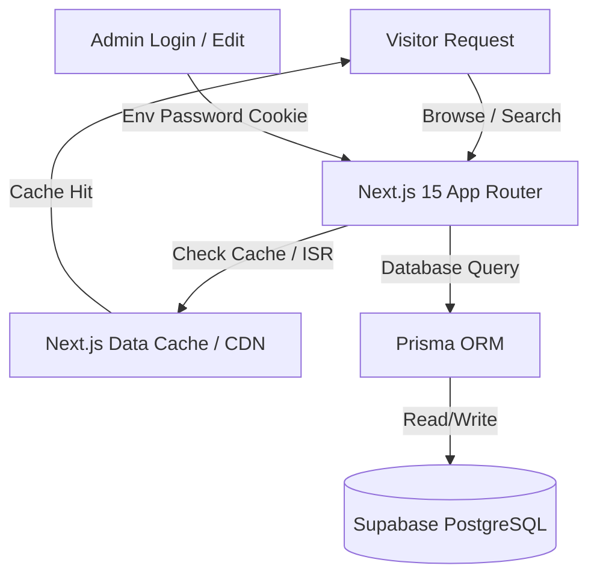

# Technical Architecture Specification: SST Q&A & Guides 7-Day MVP

This document specifies the technical design, database schemas, API architecture, caching protocols, and SEO systems for the Scaler School of Technology (SST) Q&A and Guides platform 7-Day MVP.

---

## 1. System Topology & Architectural Decisions

To optimize for **SEO**, **Simplicity**, **Zero Deployment Friction**, and **No-Cold-Starts**, the application uses the following stack:



* **Next.js 15 (App Router)**: Leverages React Server Components (RSC) to pre-render public dynamic routes into static HTML at build time.
* **Supabase (PostgreSQL)**: Fully hosted PostgreSQL instance. Communication goes through Prisma client.
* **Simplified Admin Security**: Bypasses NextAuth/Auth.js. Authenticates the `/admin` workspace using a single cookie verified against an environment variable `ADMIN_PASSWORD`.
* **Incremental Static Regeneration (ISR)**: Edge caching that updates on-demand when the Admin publishes content via Server Actions.

---

## 2. Database Schema & Prisma Models

We omit user credentials, registration logs, upvote tables, and tag join tables to maintain an ultra-lean database.

### 2.1 Prisma Schema (`schema.prisma`)

```prisma
datasource db {
  provider  = "postgresql"
  url       = env("DATABASE_URL")
  directUrl = env("DIRECT_URL") // Required for Supabase connection pooling
}

generator client {
  provider = "prisma-client-js"
}

enum QuestionStatus {
  PENDING
  PUBLISHED
  IGNORED
}

model Category {
  id          String     @id @default(uuid())
  name        String     @unique // e.g., "Exploring SST", "NSET"
  slug        String     @unique // e.g., "exploring-sst", "nset"
  description String?
  order       Int        @default(0)
  questions   Question[]
  guides      Guide[]

  @@map("categories")
}

model Question {
  id              String         @id @default(uuid())
  categoryId      String
  category        Category       @relation(fields: [categoryId], references: [id], onDelete: Cascade)
  title           String         // e.g., "Can I survive SST without coding?"
  slug            String         @unique // SEO URL path
  body            String?        @db.Text
  visitorEmail    String?        // For notification alerts
  status          QuestionStatus @default(PENDING)
  viewsCount      Int            @default(0)
  
  // Custom SEO Overrides (Optional)
  metaTitle       String?
  metaDescription String?        @db.VarChar(160)
  
  // Import/Seeding Attributes
  sourceType      String         @default("user") // e.g. "user", "faq_import"
  isSeeded        Boolean        @default(false)
  
  createdAt       DateTime       @default(now())
  updatedAt       DateTime       @updatedAt
  answer          Answer?
  leads           LeadRequest[]

  @@index([status, categoryId])
  @@index([slug])
  @@map("questions")
}

model Answer {
  id         String   @id @default(uuid())
  questionId String   @unique
  question   Question @relation(fields: [questionId], references: [id], onDelete: Cascade)
  body       String   @db.Text // Markdown response
  createdAt  DateTime @default(now())
  updatedAt  DateTime @updatedAt

  @@map("answers")
}

model Guide {
  id              String   @id @default(uuid())
  categoryId      String
  category        Category @relation(fields: [categoryId], references: [id])
  title           String   // H1 Title
  slug            String   @unique // SEO Slug
  content         String   @db.Text // Markdown body
  metaDescription String   @db.VarChar(160) // Critical for SEO snippets
  coverImage      String?  // Optional thumbnail path
  isPublished     Boolean  @default(false)
  createdAt       DateTime @default(now())
  updatedAt       DateTime @updatedAt

  @@index([slug])
  @@map("guides")
}

model LeadRequest {
  id          String    @id @default(uuid())
  questionId  String?
  question    Question? @relation(fields: [questionId], references: [id], onDelete: SetNull)
  name        String
  contactInfo String    // Email or WhatsApp
  message     String    @db.Text
  isResolved  Boolean   @default(false)
  createdAt   DateTime  @default(now())

  @@map("lead_requests")
}
```

---

## 3. Directory Layout (Next.js 15)

```
/
├── prisma/
│   ├── schema.prisma
│   └── seed.ts                  # Seeds categories and initial 50 questions
├── public/
│   └── assets/
├── src/
│   ├── app/
│   │   ├── layout.tsx
│   │   ├── page.tsx             # Homepage (Journey + Search)
│   │   │
│   │   ├── (public)/
│   │   │   ├── ask/
│   │   │   │   └── page.tsx     # Ask question with duplicate warning
│   │   │   ├── parents/
│   │   │   │   └── page.tsx     # Parents landing hub
│   │   │   ├── questions/
│   │   │   │   └── [slug]/
│   │   │   │       └── page.tsx # Q&A Detail Page
│   │   │   ├── guides/
│   │   │   │   └── [slug]/
│   │   │   │       └── page.tsx # Guide Detail Page
│   │   │
│   │   ├── admin/
│   │   │   ├── page.tsx         # Password login screen
│   │   │   └── dashboard/
│   │   │       └── page.tsx     # Moderation queue (Protected via session cookie check)
│   │   │
│   │   ├── api/
│   │   │   └── sitemap/
│   │   │       └── route.ts     # Dynamic XML Sitemap
│   │   └── robots.txt
│   │
│   ├── actions/
│   │   ├── question.ts          # askQuestion, getDuplicates
│   │   ├── admin.ts             # loginAdmin, publishAnswer, publishGuide
│   │   └── lead.ts              # submitLeadRequest
│   │
│   ├── components/
│   │   ├── ui/                  # Shadcn components (Button, Input, Card, Dialog)
│   │   ├── Layout/
│   │   │   ├── Header.tsx
│   │   │   └── Footer.tsx
│   │   └── SearchBar.tsx
│   │
│   └── lib/
│       └── db.ts                # Prisma client config
```

---

## 4. Simplified Admin Auth (Single Password Cookie)

Instead of setting up libraries like Auth.js, we authenticate requests using a simple HTTP-only cookie.

1. **Login Action**: When the user enters the password on `/admin`, a Server Action verifies it against `process.env.ADMIN_PASSWORD`.
2. **Session Cookie**: If it matches, the Server Action sets an encrypted or simple signature cookie `admin_session=true` with a 7-day expiration.
3. **Route Protection**: The `/admin/dashboard` server component performs a direct server check:
   ```typescript
   // src/app/admin/dashboard/page.tsx
   import { cookies } from "next/headers";
   import { redirect } from "next/navigation";
   
   export default async function AdminDashboard() {
     const cookieStore = await cookies();
     const adminSession = cookieStore.get("admin_session")?.value;
     
     if (adminSession !== "true") {
       redirect("/admin");
     }
     
     // Render Dashboard Queue...
   }
   ```
